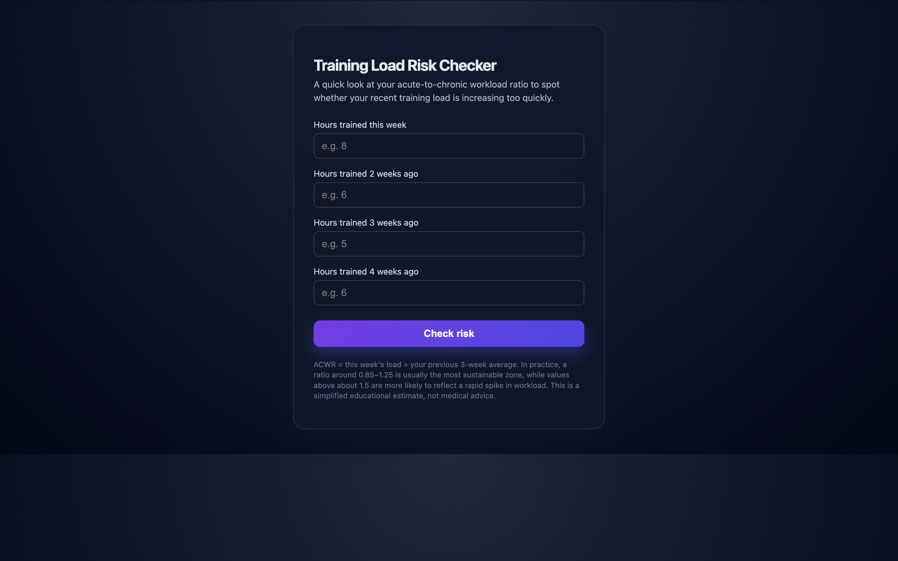
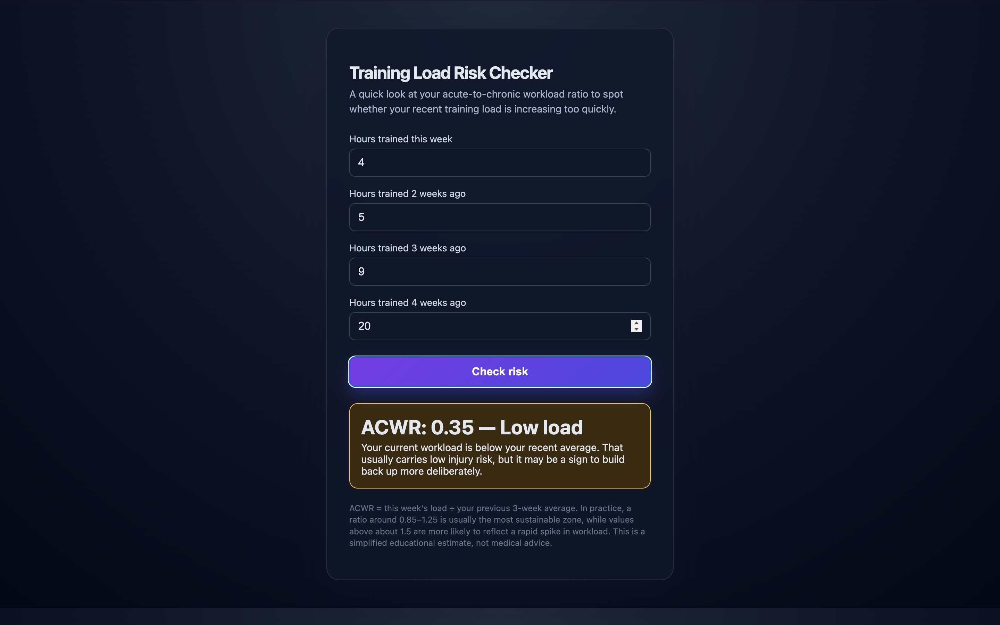

# Training Load Risk Checker

A lightweight browser-based tool for estimating training load risk using the Acute:Chronic Workload Ratio (ACWR). It helps athletes, coaches, and fitness enthusiasts quickly compare this week's training load with the recent workload baseline and spot when training is ramping up too quickly.




## What it does

The app asks for:

- hours trained this week
- hours trained 2 weeks ago
- hours trained 3 weeks ago
- hours trained 4 weeks ago

It then calculates:

- acute load = current week
- chronic load = average of the previous 3 weeks
- ACWR = acute load / chronic load

The result is categorized into a simple risk band:

- Good balance
- Watch the load
- High risk
- Low load
- No baseline yet

## Why this matters

ACWR is commonly used in sports science to identify whether recent training volume is increasing faster than the body can adapt. A large spike in workload is often associated with a higher risk of overuse injury, while a more stable workload tends to be more sustainable.

This tool is educational and informational only. It is not a medical diagnosis or a substitute for professional coaching, medical advice, or individualized training planning.

## How to use it

1. Open the project in a browser.
2. Enter the hours trained for each of the last four weeks.
3. Click the button to calculate the result.
4. Review the ACWR and interpretation.

## Running locally

Since this is a simple static page, you can open the file directly in a browser:

```bash
open index.html
```

Or serve it locally if you prefer:

```bash
python3 -m http.server 8000
```

Then visit:

```text
http://localhost:8000
```

## Project structure

```text
.
├── index.html
├── README.md
└── .gitignore
```

## Notes

- This app is intentionally simple and dependency-free.
- It does not store data or require a backend.
- It is best used as a quick educational estimate, not a clinical tool.

## License

This project is provided as-is for educational and personal use.
